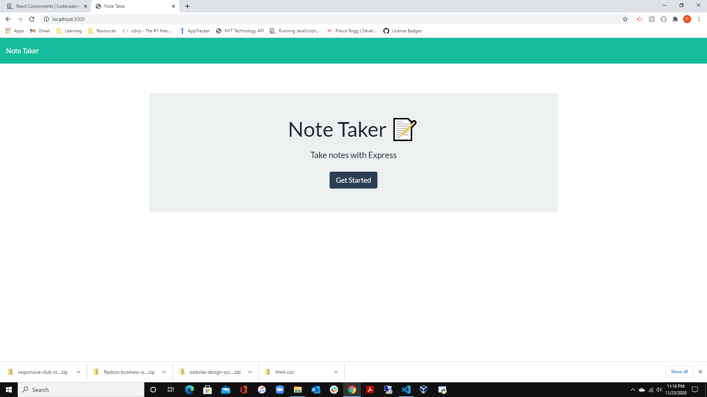
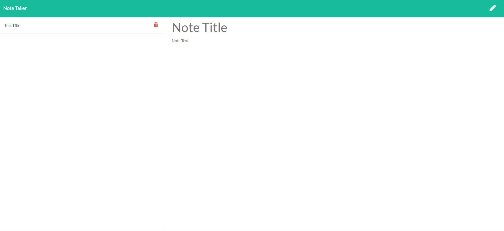

# Note-Taker

## Table of Contents
* [Description](#description)
* [User Story](#user-story)
* [Business context](#business-context)
* [Technologies Used](#technologies-used)
* [Links and Screenshot](#links-and-screenshot)

## Description
This is an application that can be used to write, save, and delete notes. It has an Express backend and can retrieve and save note data from a JSON file.

## Business Context
For users that need to keep track of a lot of information, it's easy to forget or be unable to recall something important. Being able to take persistent notes allows users to have written information available when needed

## User Story
AS A user, I want to be able to write and save notes  
I WANT to be able to delete notes I've written before  
SO THAT I can organize my thoughts and keep track of tasks I need to complete  

## Technologies Used
* HTML
* CSS
* JavaScript
* Node.js
* Express
* Postman
* Heroku

## Links and Screenshot
* GitHub Repository: https://github.com/progg1992/noteTaker.git
* Deployed Application: https://shrouded-lowlands-90629.herokuapp.com/

  

  

